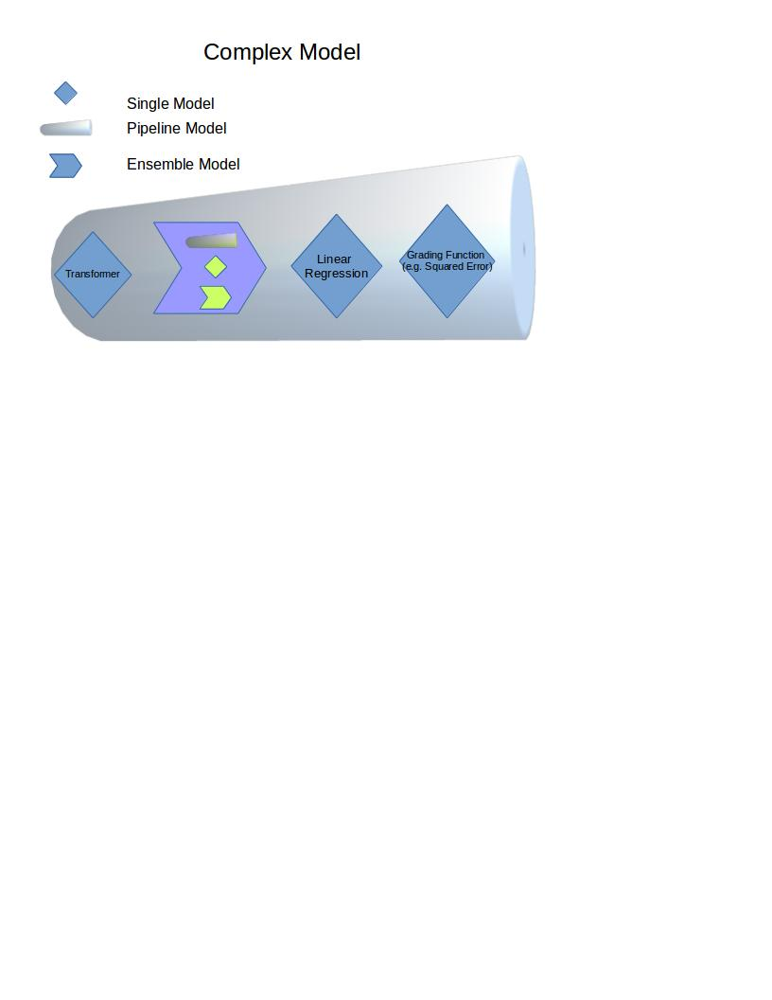

# Algo Framework for Mahout

### High Level Concepts

- **Model** Base Class
- **Regression** Maps a vector to a single value
- **Transformer** Maps a vector to a vector
 - Possible for preprocessing as well as multiple input -> outputs
 - A classifier predicts probabilities of each class
- **Classifier** a wrapper for a transformer that predicts a label instead of a probability vector
- **Ensemble** Takes multiple models, cbinds output into a single matrix (pipelines are models and can be used in an ensemble, as can other ensembles)
- **Pipeline** Arranges multiple models in serial, output of one model is passed as input to next model (ensembles are models and can be steps in a pipeline, as can other pipelines)

Ensembles and pipelines allow for complex model building.

### Wrappers

Lots of other projects have lots of good implementations for certain algorithms. For example, most of the engines have some native packages such as MLib and FlinkML, there also exists 3rd party libraries such as dl4j.  We should have wrappers to incorporate those algorithms so we aren't replicating work.

### Parameter search

Not implemented yet, but every model should expose 'settable parameters' and 'logical ranges' for each parameter.  Complex Models like pipelines and ensembles will collect these settings from their sub models.

We will have at least three parameter search strategies:
- Grid Search - Go through each possible combination at specified intervals
- Random Search - a set of N parameter spaces are generated each is tried
- EA/GA Search - Requires a loss function/objective which is minimized via GA
- Gradient Descent Search - parameter space is optimized via gradient descent
